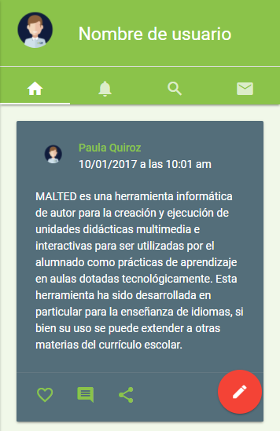
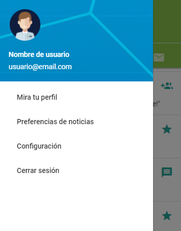
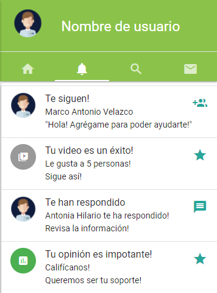
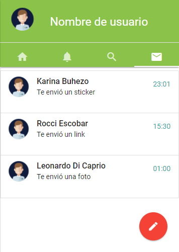

# Reto de Código - Red Social: Teach&Learn

* **Track:** _Common Core_
* **Curso:** _Crea tu propia red social_
* **Unidad:** _Crea tu propia red social_

***

## Objetivo
Crear una red social.

## Antecedentes
Un emprendedor muy visionario nos ha encargado crear una red social. No nos da muchos detalles sobre qué tipo de red social quiere, él solo nos dice que creamos la que mejor podamos y que luego lo convenzamos de que nuestra red social será la más exitosa.

Para él, hay algunos puntos básicos que debe tener una red social:

* Perfiles de usuarios.
* Un newsfeed donde puedes ver las actualizaciones de todos tus contactos.
* Un lugar donde poder escribir posts.
* Un lugar para subir fotos.
* Capacidad para poder tener amigos o para poder seguir a personas/marcas dentro de la red social.
* Ser mobile friendly
* Etc.

## ¿Qué se requiere?
* Trabajar en parejas
* Tener una planificación
* La definición del diseño
* Desplegar el producto en Github Pages.
* Opcional, si se desarrolla un login o se desea almacenar la información en una base de datos, usar Firebase.

## Configuración y uso
1. **Vista principal:** El usuario tiene la opción de registrarse con el botón “Sign up”, cuando ya está registrado, cuenta con el botón “Login” para iniciar sesión. También puede iniciar sesión con Facebook y Google.
2. **Vista de inicio:** En esta vista el usuario puede visualizar las publicaciones de las personas a las que sigue y crear publicaciones (botón rojo derecho inferior). También puede ver parte de su información de perfil, como su foto, nombre completo y un botón “+”, que en una próxima versión, podrá acceder a su perfil completo y modificarlo.
Además, puede acceder a las vistas de notificaciones, mensajes y cerrar sesión.
3. **Vista deslizante derecho:** Esta vista está disponible para la versión mobile. El usuario puede acceder dando click en su fotografía ubicada en el header. Esta vista presenta opciones de ir al perfil, preferencias de noticias, configuración y cerrar sesión.
4. **Vista de notificaciones:** El usuario puede acceder dando click a la campana (versión móbile) o dando click al botón “notificaciones” (versión desktop).
5. **Vista de mensajes:** El usuario puede acceder dando click al ícono de un mensaje (versión móbile) o dando click al botón “mensajes” (versión desktop). El usuario puede crear mensajesdando click al botón rojo ubicado en la parte derecha inferior.

## Vistas del Producto

* **_Vista principal_**:

* **_Vista de inicio (Versión desktop)_**:

* **_Vista de inicio (Versión mobile)_**:

* **_Vista deslizante derecho (versión mobile)_**:

* **_Vista de notificaciones (versión mobile)_**:

* **_Vista de mensajes (versión mobile)_**:

## Especificaciones
* Se trabajó en versión mobile y versión desktop.
* Se utilizó el framework materializecss en su ultima versión.
* Se utilizó la librería jQuery en su versión 3.2.1.
* Se utilizó la librería Moment.js en su versión 2.19.2.
* Se utilizó la plataforma de desarrollo de Google: firebase, para la autentificación de usuarios con Facebook y google, y para almacenar los datos de los usuarios que inicien sesión.

## Integrantes
* Rocci Escobar Nuñez
* Karina Buhezo Flores