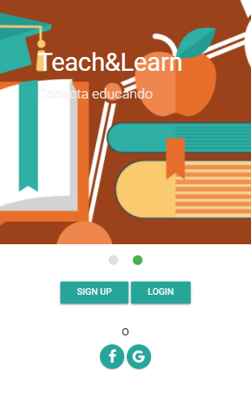
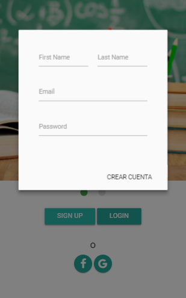

# Reto de Código - Red Social: Teach&Learn

* **Track:** _Common Core_
* **Curso:** _Crea tu propia red social_
* **Unidad:** _Crea tu propia red social_

***

## Objetivo
Crear una red social.

## Antecedentes
Un emprendedor muy visionario nos ha encargado crear una red social. No nos da muchos detalles sobre qué tipo de red social quiere, él solo nos dice que creemos la que mejor podamos y que luego lo convenzamos de que nuestra red social será la más exitosa.

Para él, hay algunos puntos básicos que debe tener una red social:

* Perfiles de usuarios.
* Un newsfeed donde puedes ver las actualizaciones de todos tus contactos.
* Un lugar donde poder escribir posts.
* Un lugar para subir fotos.
* Capacidad para poder tener amigos o para poder seguir a personas/marcas dentro de la red social.
* Ser mobile friendly
* Etc.

## ¿Qué se requiere?
* Trabajar en parejas
* Tener una planificación
* La definición del diseño
* Diseño mobile friendly
* Desplegar el producto en Github Pages
* Opcional, si se desarrolla un login o se desea almacenar la información en una base de datos, usar Firebase.

## Especificaciones
* Se trabajó en versión mobile y versión desktop.
* Se utilizó el framework materializecss en su ultima versión.
* Se utilizó la librería jQuery en su versión 3.2.1.
* Se utilizó la plataforma de desarrollo de Google: firebase.

# Vistas del Producto

* Vista de inicio:

* Vista de login con email y password:

* Vista home:
